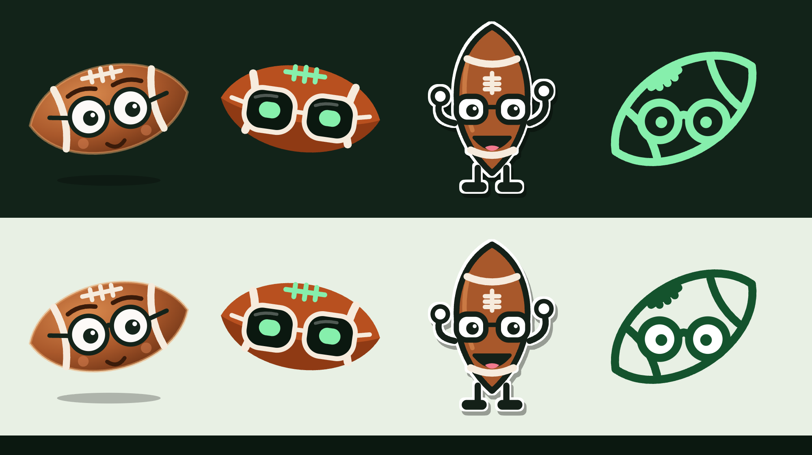
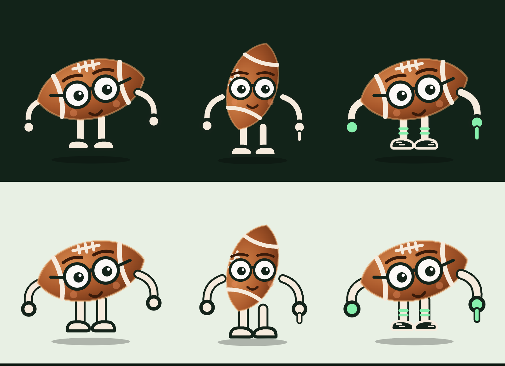

# Stat Watch mascot

A football wearing glasses: the stat-watcher. Four directions were drawn and **Studious was chosen** (cute, and its eyes follow the pointer). A second round then gave Studious legs and arms, in three versions; **that pick is still open**. This page records the brief, the options, what each costs, and how motion and size were designed in, so the final pick can go straight into the app.

Left to right: Studious, Scoreboard, Sticker, Monoline. Top row on the dark theme, bottom row on the light one.

## Brief

- It represents the site: a football that looks at the game through glasses, a stat nerd rather than a jock.
- It appears in several places, from tiny (header logo, a corner of a card, the browser tab) to big (empty states, an error or loading page, the red-zone alert).
- It must look right at both ends, so every direction has a reduced version for small sizes.
- It must animate well. Motion is not built yet, but every direction is drawn with the moving parts separate, and a first set of motions is already in the prototype to prove it.
- It stays inside the app's palette: forest green and mint (`#0B1810`, `#122319`, `#86EFAC`, `#14532D`), plus a leather brown that is not the orange of the pylon accent.

## How the options were made

Direction came from the frontend-design lens: one memorable thing (the glasses), everything else quiet, nothing borrowed from a generic mascot kit. The craft lens (Emil Kowalski) then critiqued it for motion: ease-out on everything that responds, transform and opacity only, nothing that restarts from zero when interrupted, reduced motion respected, and idle motion kept rare enough not to wear on a page people leave open all Sunday. The critique changed three things: the moving parts were separated into named groups, the first Scoreboard idea (a single wide visor, which read as a robot) became two lenses with temples, and the Monoline laces moved away from the lens.

## The four directions

| Direction | Axis | Wins when | Costs |
| --- | --- | --- | --- |
| [Studious](mascot/studious.svg) | Depth: shaded, full character with brows, cheeks and a smile | You want a mascot people grow fond of, mostly at medium and large sizes | The most detail to keep legible, so the smallest sizes lose the face and keep only eyes and shape |
| [Scoreboard](mascot/scoreboard.svg) | Face concept: flat, geometric, glasses as dark lenses with mint stat-line eyes | You want it to feel like part of the app, in its own colours | Least human of the four; the mint eyes tie it to the app and to nothing else |
| [Sticker](mascot/sticker.svg) | Body: a standing football with arms and cleats, thick ink outline, white sticker edge | You want poses (waving, cheering at a touchdown) and a character that can carry a page | The most to draw and animate; the white edge and shadow need a CSS filter, and at small sizes it is only the head |
| [Monoline](mascot/monoline.svg) ([light](mascot/monoline-light.svg)) | Theming: one stroke in one colour, follows the surface | You want an icon that sits in headers and buttons and recolours with the theme | Least personality; thin at the smallest sizes, so it should not go below 24 px |

## Round two: Studious with legs and arms

Studious was chosen, with one request: legs and arms, and a body that can later walk around and point at things. Three versions of it, each with every limb as its own group that turns about its own joint (hip or shoulder), so walking and pointing are only a matter of rotating those groups.

| Direction | Axis | Wins when | Costs |
| --- | --- | --- | --- |
| [Stubby](mascot/studious-stubby.svg) | Proportion: the small round ball on short legs, noodle arms, round mitts | You want the cutest and the simplest, and the easiest to keep readable when small | The mitts cannot really point, only raise an arm |
| [Upright](mascot/studious-upright.svg) | Posture: the ball stands on end and leans, the face stays level | You want the most character, with room to walk and point; the right hand has a pointing finger | Reads a little less like a football at a glance; the laces end up on the side |
| [Gridiron](mascot/studious-gridiron.svg) | Styling: Stubby in kit, with striped socks, cleats, mint gloves and a pointing finger | You want it sporty, and a clear hand for pointing | The most to draw, and the busiest at small sizes |

The limbs are cream with an ink edge under them, so they read on the dark theme and on the light one. The first draft of Gridiron reused the Sticker's white edge by accident, and its dark cleats vanished on the dark theme; both were fixed.

### Rig and motion, already working in the prototype

`docs/mascot/prototype-limbs.html` is the second picker (keys `1` to `3`, `R`, `E` as before, `W` to walk, `P` to point).

| Hook | Joint | What the prototype does with it |
| --- | --- | --- |
| `m-leg-l`, `m-leg-r` | Hip | Walking: the legs swing about ±22° out of step, 680 ms per step, with a small bob on the whole body |
| `m-arm-l`, `m-arm-r` | Shoulder | Walking: the arms swing against the legs. Pointing: the right arm turns from hanging to the direction of the target (the "Point at the button" button works out the angle from where the button is) |
| `m-look`, `m-glance`, `m-lid`, `m-pupil`, `m-brow`, `m-root` | Unchanged from round one | The eyes still follow the pointer; while pointing, they look the same way as the arm |

All of it is CSS transform and opacity only, with the same ease-out as before, and it is switched off under `prefers-reduced-motion`. Walking here is in place (legs and arms swing, the body bobs); moving across the screen is a separate step. Pointing at a real element means working out its direction from the mascot, as the prototype does.

## Size behaviour

Each direction has a full drawing and a reduced one. The reduced one is the same artwork with the elements marked `detail` hidden: the mouth, brows, cheeks, stripes, shading, legs and shadow. It is used at 32 px and below. Anything under 24 px reads as a brown or mint football with two eyes, which is the intended minimum recognition. The prototype shows each direction at 16, 24, 32, 48, 72, 112 and 260 px on both themes, in the header, in an empty state, and in a toast.

## Motion hooks

Every direction exposes the same class names, so one set of motion CSS serves whichever is chosen:

| Class | What moves | Used for |
| --- | --- | --- |
| `m-root` | The whole mascot | Entrance (a short rise and fade), a slow idle bob, the wiggle on a reaction |
| `m-look` and `m-glance` | The pupils or eyes | Following the pointer (the outer group), and an occasional glance when nothing moves (the inner group) |
| `m-lid` or `m-eye` | Eyelids, or the eyes themselves | Blinking about every five seconds |
| `m-pupil` | Each pupil | Widening when something exciting happens |
| `m-brow` | Eyebrows | Lifting on a reaction (Studious) |
| `m-arm-r` | The right arm (Sticker) | Waving |

The prototype's motion uses CSS only, animates transform and opacity only, uses one strong ease-out (`cubic-bezier(0.23, 1, 0.32, 1)`) for everything that responds, and keeps each action under 700 ms. A reaction, shown by the "Red zone!" button, takes about 700 ms. Under `prefers-reduced-motion` the idle bob, blink, glance and reaction are all switched off, and pointer-following is skipped. The idle motion is deliberately small (a 3 px bob, a blink every few seconds) because the mascot sits on a page that stays open for hours.

## Try it

`docs/mascot/prototype.html` is a throwaway page with a picker for the four directions. It lives in `docs/`, so it is never built or deployed. Open the file in a browser, then:

- `1` to `4`, or the arrow keys, switch direction; `R` replays the entrance.
- Click the big mascot, or press `E`, for the red-zone reaction. The pupils follow the pointer.

The `.svg` files next to it are static poses with the hooks above kept as classes. They carry no motion; the sticker's white edge is a CSS filter set inline on the file.

## Not decided or not done

- Which of the three limbed versions to use. Once it is chosen, the other versions and both prototypes go.
- Real walking across the screen, and fuller pointing (an arm that extends, a hand that turns). Where it goes first: the red-zone alert and the empty states are the natural first places, and the pose set for Sticker would be drawn then.
- A browser tab icon: at 16 px the Scoreboard and Studious shapes survive; Monoline and Sticker need a purpose-made simplified version.
